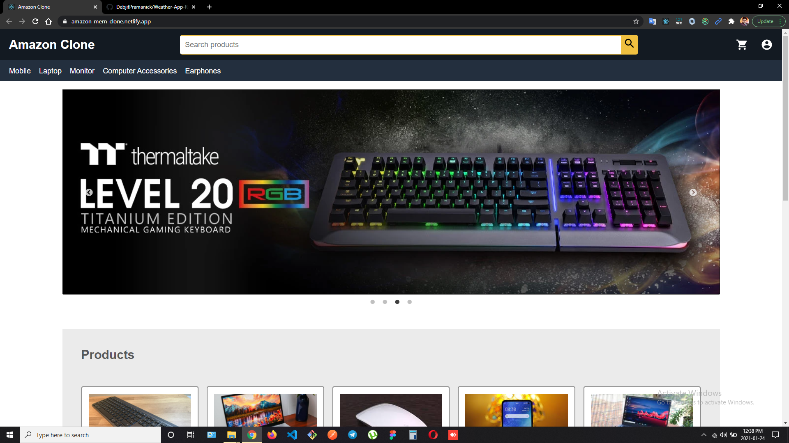
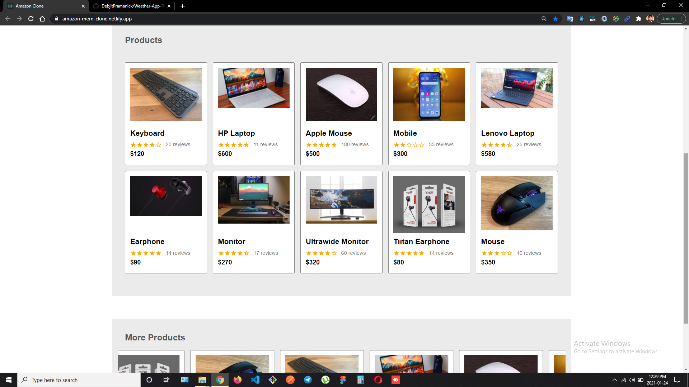
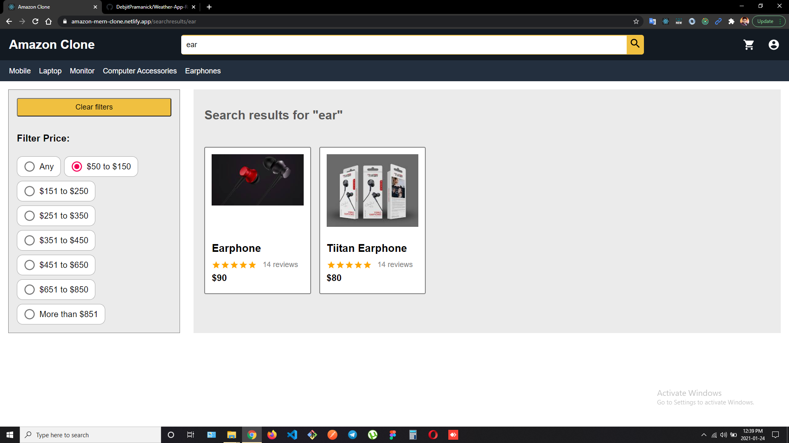
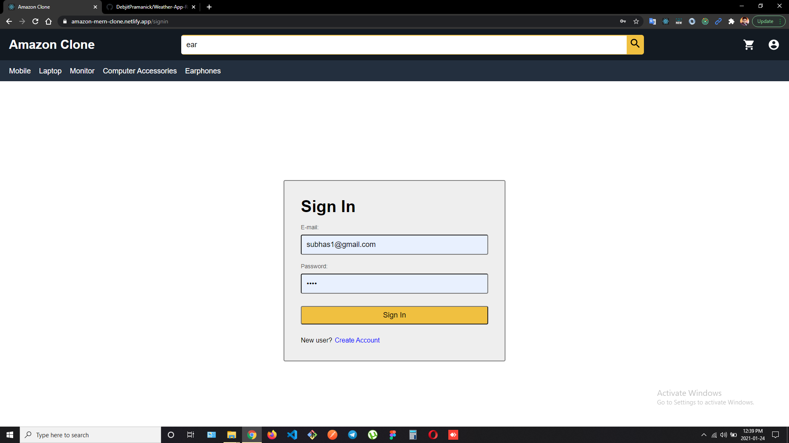
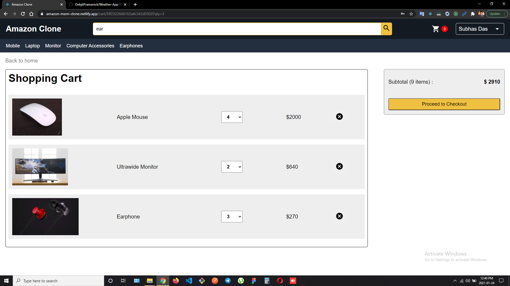
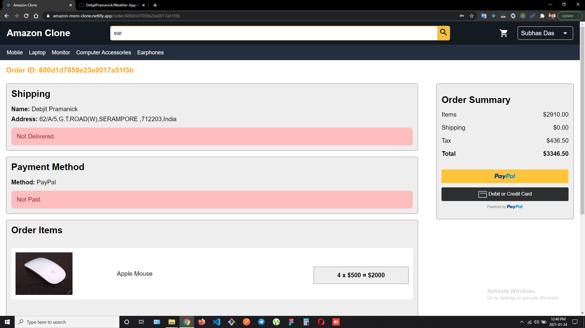

# 🛒 Amazon Clone

Hi! I'm Manas, a Computer Science student at VIT-AP and an aspiring Full Stack Developer.

This project is a full-stack Amazon clone built using the MERN stack. It replicates core e-commerce functionalities including authentication, product browsing, cart management, and order handling.

---

## 🚀 Tech Stack

- Frontend: React.js, Redux, Material UI  
- Backend: Node.js, Express.js  
- Database: MongoDB  
- Payment Integration: PayPal  

---

## 🌐 Live Demo

👉 https://amazon-inky-eta.vercel.app/

---

## 🔧 Backend API

👉 https://amazon-backend-y2kg.onrender.com

## ✨ Features

- 🔐 User authentication (Register / Login)
- 👤 User profile management
- 🔍 Product search with filters
- 🛒 Add to cart & update quantity
- 💳 Secure checkout with PayPal
- 📦 Order placement
- 📜 Order history tracking

---

## 📦 NPM Packages Used

- react-redux  
- @mui/material  
- express  
- mongoose  
- nodemon  

---

## 🧠 What I Learned

- Building a full-stack application using the MERN stack  
- Managing global state using Redux  
- Designing RESTful APIs with Express  
- Integrating third-party payment gateways (PayPal)  
- Handling user authentication and database operations  

---

## 📸 Screenshots

> Demo Credentials:
> Email: admin2023@gmail.com  
> Password: 1234  

 

 

 

 

 

---

## ⚠️ Disclaimer

This project is for educational purposes only. It is not affiliated with or endorsed by Amazon.

---

## 📬 Connect With Me

(You can add your LinkedIn / GitHub here later)
